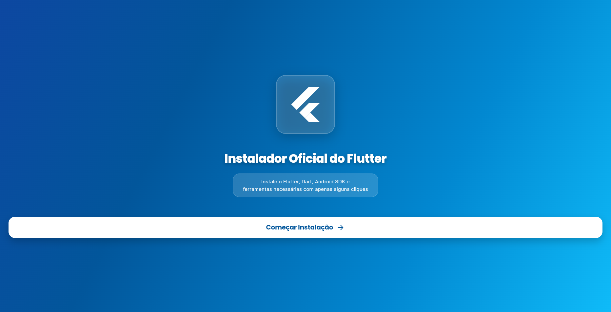

# 🎨 Flutter Install - Instalador Oficial

<p align="center">
  
</p>

**Instalador visual multiplataforma para Flutter, Dart, Android SDK e ferramentas de desenvolvimento.**

[](https://flutter.dev)
[](https://dart.dev)
[](LICENSE)
[]()

---

## 📖 Sobre o Projeto

O **Flutter Install** é um instalador gráfico que simplifica a configuração completa do ambiente de desenvolvimento Flutter em qualquer sistema operacional. Com uma interface moderna e intuitiva, o aplicativo guia você através de cada etapa da instalação, verificando automaticamente o que já está instalado e configurando todas as variáveis de ambiente necessárias.

### ✨ Características

- 🎯 **Interface Moderna** - Design glassmorphism com animações suaves
- 🔍 **Detecção Automática** - Verifica se os componentes já estão instalados
- 📊 **Progresso Visual** - Acompanhe cada etapa da instalação
- 🎨 **Multiplataforma** - Funciona em Linux, Windows e macOS
- ⚡ **Instalação Guiada** - Processo passo a passo intuitivo
- 🛡️ **Diretórios Seguros** - Avisos ao modificar caminhos padrão
- 🚀 **Configuração Automática** - Variáveis de ambiente configuradas automaticamente

---

## 🎯 O Que Instala

### Componentes Obrigatórios
1. **Dart SDK** - Linguagem de programação
2. **Flutter SDK** - Framework de desenvolvimento
3. **Android Studio** - IDE para desenvolvimento Android

### Componentes Opcionais
4. **VS Code** - Editor de código leve
5. **Google Chrome** - Navegador para testes web

Além disso, configura automaticamente:
- Android SDK e ferramentas de linha de comando
- Java JDK (17 ou 11)
- Variáveis de ambiente (PATH, ANDROID_HOME, etc.)
- Licenças do Android SDK

---

## 🚀 Como Usar

### Pré-requisitos

- **Linux**: Sistema baseado em Arch (pacman) ou derivados
- **Windows**: Windows 10/11 com Chocolatey ou Winget
- **macOS**: macOS 10.15+ com Homebrew

### Instalação

#### Via Release (Recomendado)

Baixe a versão mais recente para seu sistema operacional:

- [Linux (AppImage/DEB/TAR.GZ)](https://github.com/EoDaniel777/flutter_install/releases)
- [Windows (EXE/MSI)](https://github.com/EoDaniel777/flutter_install/releases)
- [macOS (DMG)](https://github.com/EoDaniel777/flutter_install/releases)

#### Compilando do Código Fonte

```bash
# Clone o repositório
git clone https://github.com/EoDaniel777/flutter_install.git
cd flutter_install

# Instale as dependências
flutter pub get

# Execute no Linux
flutter run -d linux

# Ou compile para release
flutter build linux --release
```

---

## 📱 Screenshots

<p align="center">
  
  
  
</p>

---

## 🛠️ Tecnologias Utilizadas

### Framework
- **Flutter** 3.24.5 - UI multiplataforma
- **Dart** 3.10.4 - Linguagem de programação

### Packages
- [google_fonts](https://pub.dev/packages/google_fonts) - Tipografia profissional
- [icons_plus](https://pub.dev/packages/icons_plus) - Biblioteca de ícones
- [flutter_svg](https://pub.dev/packages/flutter_svg) - Suporte a SVG
- [shimmer](https://pub.dev/packages/shimmer) - Efeitos de brilho
- [fluttertoast](https://pub.dev/packages/fluttertoast) - Notificações toast
- [dio](https://pub.dev/packages/dio) - Cliente HTTP para downloads

---

## 🎨 Design

### Princípios de Design
- **Material Design 3** - Design system moderno
- **Glassmorphism** - Efeitos de transparência e blur
- **Animações Fluidas** - Transições suaves entre telas
- **Feedback Visual** - Indicadores claros de estado

### Paleta de Cores
- **Dart SDK**: `#0175C2` (Azul Dart)
- **Flutter SDK**: `#02569B` (Azul Flutter)
- **Android Studio**: `#3DDC84` (Verde Android)
- **VS Code**: `#007ACC` (Azul VS Code)
- **Google Chrome**: `#DB4437` (Vermelho Chrome)

---

## 🏗️ Estrutura do Projeto

```
flutter_install/
├── lib/
│   ├── main.dart                    # UI principal e telas
│   └── installation_manager.dart    # Lógica de instalação
├── assets/
│   └── images/
│       ├── Dart.svg                 # Logo oficial do Dart
│       └── dart_lang.png            # Logo Dart (backup)
├── docs/
│   ├── img01.png                    # Screenshots
│   └── install-flutter.sh           # Script original (referência)
├── linux/                           # Configuração Linux
├── windows/                         # Configuração Windows
├── macos/                           # Configuração macOS
├── pubspec.yaml                     # Dependências
├── CHANGELOG.md                     # Histórico de mudanças
└── README.md                        # Este arquivo
```

---

## 🔧 Desenvolvimento

### Setup Local

```bash
# Clone o repositório
git clone https://github.com/EoDaniel777/flutter_install.git
cd flutter_install

# Instale as dependências
flutter pub get

# Execute em modo debug
flutter run -d linux

# Execute análise de código
flutter analyze
```

### Build para Produção

```bash
# Linux
flutter build linux --release

# Windows (no Windows)
flutter build windows --release

# macOS (no macOS)
flutter build macos --release
```

---

## 🐧 Linux

### Distribuições Suportadas
- Arch Linux e derivados (Manjaro, EndeavourOS)
- Ubuntu/Debian (em desenvolvimento)
- Fedora/CentOS (em desenvolvimento)

### Instalação Atual (Arch)
Utiliza `pacman` para instalar pacotes do sistema:
```bash
sudo pacman -S flutter dart android-studio code google-chrome
```

---

## 🪟 Windows

### Status
✅ UI 100% funcional
⚠️ Backend em desenvolvimento

### Gerenciadores Suportados
- Chocolatey
- Winget (Windows 10+)

### Como Compilar
```powershell
# Requisitos: Visual Studio 2022 com C++ tools
flutter build windows --release
```

---

## 🍎 macOS

### Status
✅ UI 100% funcional
⚠️ Backend em desenvolvimento

### Gerenciador
- Homebrew

### Como Compilar
```bash
# Requisitos: Xcode
flutter build macos --release
```

---

## 📝 Roadmap

### ✅ Versão 1.0 (Atual)
- [x] Interface moderna e responsiva
- [x] Instalação completa para Arch Linux
- [x] Detecção automática de componentes
- [x] Configuração de variáveis de ambiente
- [x] Logos oficiais (Dart, Flutter, etc.)
- [x] Animações e transições suaves

### 🔜 Versão 1.1
- [ ] Suporte completo para Windows (Chocolatey)
- [ ] Suporte completo para macOS (Homebrew)
- [ ] Suporte para Ubuntu/Debian (apt)
- [ ] Download com barra de progresso real
- [ ] Logs detalhados da instalação

### 🔮 Versão 2.0
- [ ] Dark mode
- [ ] Seleção de versões do Flutter
- [ ] Instalação de plugins VS Code
- [ ] Verificação de espaço em disco
- [ ] Desinstalador integrado
- [ ] Atualização automática

---

## 🤝 Contribuindo

Contribuições são bem-vindas! Sinta-se à vontade para:

1. Fazer um Fork do projeto
2. Criar uma branch para sua feature (`git checkout -b feature/AmazingFeature`)
3. Commit suas mudanças (`git commit -m 'Add some AmazingFeature'`)
4. Push para a branch (`git push origin feature/AmazingFeature`)
5. Abrir um Pull Request

### Áreas que Precisam de Ajuda
- 🪟 Implementação completa do backend Windows
- 🍎 Implementação completa do backend macOS
- 🐧 Suporte para mais distribuições Linux
- 🌐 Tradução para outros idiomas
- 🧪 Testes automatizados

---

## 📄 Licença

Este projeto está sob a licença MIT. Veja o arquivo [LICENSE](LICENSE) para mais detalhes.

---

## 👨‍💻 Autor

**Daniel** ([@EoDaniel777](https://github.com/EoDaniel777))

---

## 🙏 Agradecimentos

- [Flutter Team](https://flutter.dev) - Framework incrível
- [Dart Team](https://dart.dev) - Linguagem poderosa
- [Google Fonts](https://fonts.google.com) - Tipografia
- Comunidade Flutter Brasil

---

## 📞 Suporte

- 🐛 [Reportar Bug](https://github.com/EoDaniel777/flutter_install/issues)
- 💡 [Solicitar Feature](https://github.com/EoDaniel777/flutter_install/issues)
- 📧 Email: [seu-email@exemplo.com]

---

## ⭐ Star History

Se este projeto te ajudou, considere dar uma ⭐!

[](https://star-history.com/#EoDaniel777/flutter_install&Date)

---

<p align="center">
  Feito com ❤️ usando Flutter
</p>
